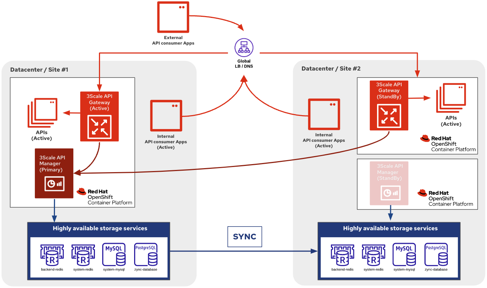
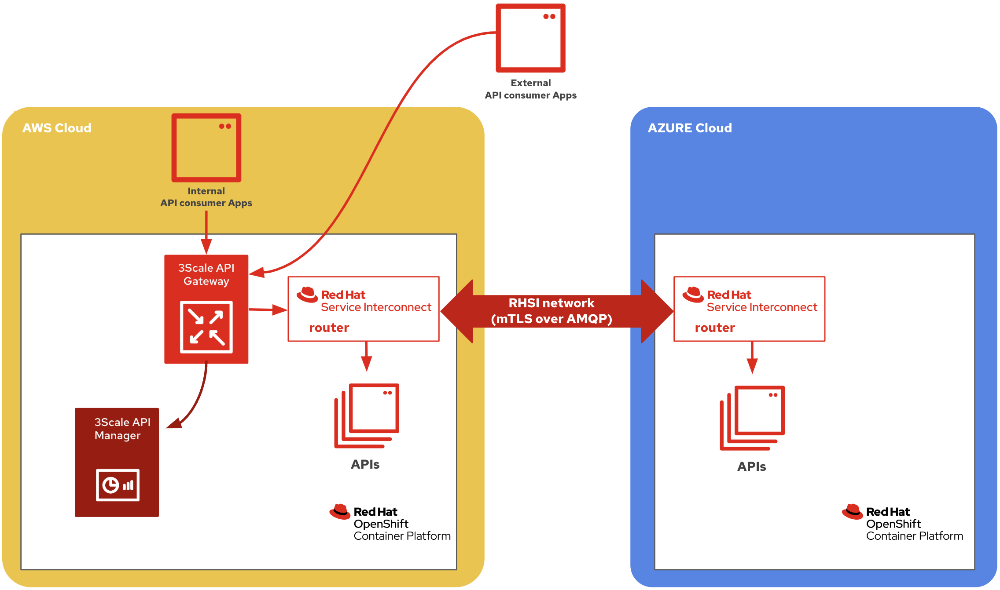

# RHSI Hackfest Nov 14-16 2023 

## Securing and exposing APIs location-lessly using Red Hat 3scale API Management and Red Hat Service Interconnect

### Overview

Red Hat 3scale API Management solution has two main components:
- The **API Manager** used for API management policy configuration
- The **API Gateway** that executes the API management policies.

The following diagram shows a multi-cluster/sites deployment configuration that is possible out of the box for Red Hat 3scale API Management/



- The 3scale API Manager component can only be active (primary) in one OpenShift cluster
- The 3scale API Gateways can be deployed anywhere. However, this requires a global load-balancer if multiple instances of the same API are deployed across multiple environments.

Red Hat Service Interconnect can be leveraged in order to easily secure multiple instances of an API that are deployed across multiple environments. For instance:



## Instructions 

### Prepare :cloud: AWS Cloud environment

#### Prerequisites

TODO

#### Deploy the _Library Books API_ backend services

1. Create the `rhsi-hackfest-apibackend` namespace:
    ```
    oc apply -f ./ThreescaleAPIProducts/library-books-api/openshift_manifests/rhsi-hackfest-apibackend_namespace.yaml
    ```

2. Deploy the _Library Books API_ service to be secured by 3scale:
    ```
    oc -n rhsi-hackfest-apibackend apply -f ./ThreescaleAPIProducts/library-books-api/openshift_manifests/books-api-v1.yaml
    oc set env deploy/books-api-v1 DEPLOYMENT_LOCATION="OpenShift on AWS Cloud"
    oc -n rhsi-hackfest-apibackend apply -f ./ThreescaleAPIProducts/library-books-api/openshift_manifests/books-api-v2.yaml
    oc set env deploy/books-api-v2 DEPLOYMENT_LOCATION="OpenShift on AWS Cloud"
    ```

#### Secure the _Library Books API_ API with Red Hat 3scale API Management

TODO

### Prepare :cloud: AZURE Cloud environment

#### Prerequisites

TODO

#### Deploy the _Library Books API_ backend services

1. Create the `rhsi-hackfest-apibackend` namespace:
    ```
    oc apply -f ./ThreescaleAPIProducts/library-books-api/openshift_manifests/rhsi-hackfest-apibackend_namespace.yaml
    ```

2. Deploy the _Library Books API_ service to be secured by 3scale:
    ```
    oc -n rhsi-hackfest-apibackend apply -f ./ThreescaleAPIProducts/library-books-api/openshift_manifests/books-api-v1.yaml
    oc set env deploy/books-api-v1 DEPLOYMENT_LOCATION="OpenShift on AZURE Cloud"
    oc -n rhsi-hackfest-apibackend apply -f ./ThreescaleAPIProducts/library-books-api/openshift_manifests/books-api-v2.yaml
    oc set env deploy/books-api-v2 DEPLOYMENT_LOCATION="OpenShift on AZURE Cloud"
    ```

### Configure the RHSI network

#### :cloud: AWS Cloud Red Hat Service Interconnect Router

1. Login to the AWS OCP cluster
    ```shell script
    oc login...
    ```

2. Make sure the current project is `rhsi-hackfest-apibackend`
    ```shell script
    oc project rhsi-hackfest-apibackend
    ```

3. Initialize the Service Interconnect Router.
    > NOTE: This should install the Service Interconnect resources in the rhsi-hackfest-apibackend namespace of the AWS OCP cluster 
    ```shell script
    skupper init --enable-console --enable-flow-collector --console-auth unsecured --site-name aws-ocp
    ```

4. See the status of the skupper network
    ```shell script
    skupper status
    ```

5. Expose the `books-api-v1` and `books-api-v2` services over the link

    ```shell script
    skupper expose deployment/books-api-v1 --address books-api-v1 --port 80 --target-port 8080 --protocol http
    skupper expose deployment/books-api-v2 --address books-api-v2 --port 80 --target-port 8080 --protocol http
    ```

6. Create a token in the AWS OCP cluster namespace that will be used to create the link with the AZURE OCP cluster namespace
    ```shell script
    skupper token create secret_aws_azure.token
    ```

#### :cloud: AZURE Cloud Red Hat Service Interconnect Router

1. login to the AZURE OCP cluster
    ```shell script
    oc login...
    ```

2. Make sure the current project is `rhsi-hackfest-apibackend`
    ```shell script
    oc project rhsi-hackfest-apibackend
    ```

3. Initialize the Service Interconnect Router.
    > NOTE: This should install the Service Interconnect resources in the rhsi-hackfest-apibackend namespace of the AZURE OCP cluster 
    ```shell script
    skupper init --site-name azure-ocp
    ```

4. Use the previously created AWS token file to create a link between the `rhsi-hackfest-apibackend` namespaces on AWS and AZURE OCP clusters
    >NOTE: /!\ Beware, the token is only usable once. Plus, it expires after 15mn if not used.
    ```shell script
    skupper link create ./secret_aws_azure.token --name azure-to-aws --cost 99999
    ```

6. Expose the `books-api-v1` and `books-api-v2` services over the link
    ```shell script
    skupper expose deployment/books-api-v1 --address books-api-v1 --port 80 --target-port 8080 --protocol http
    skupper expose deployment/books-api-v2 --address books-api-v2 --port 80 --target-port 8080 --protocol http
    ```
