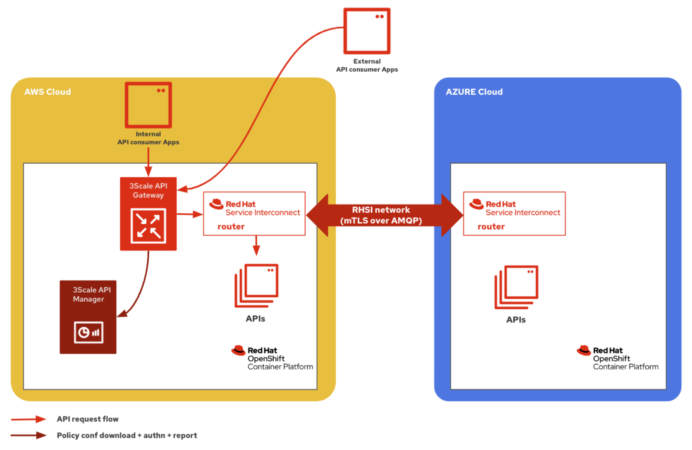
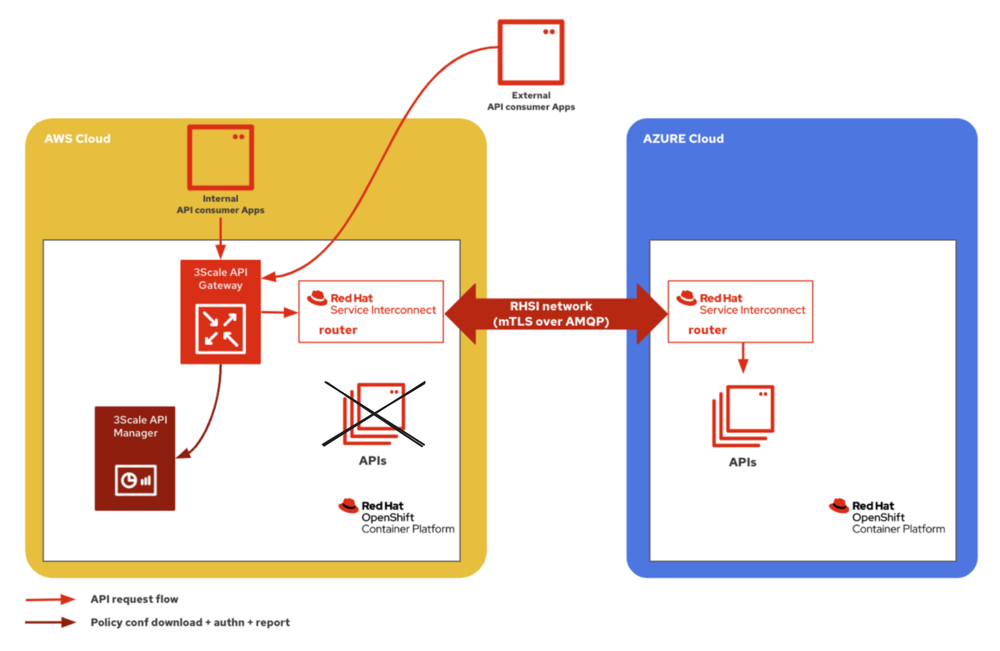
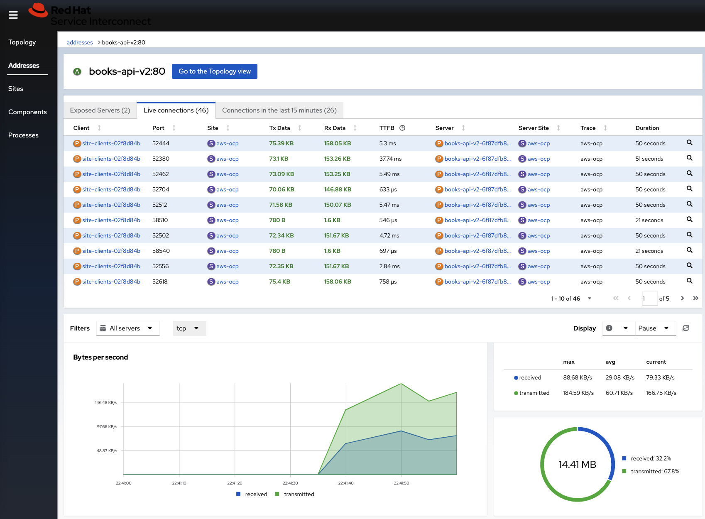
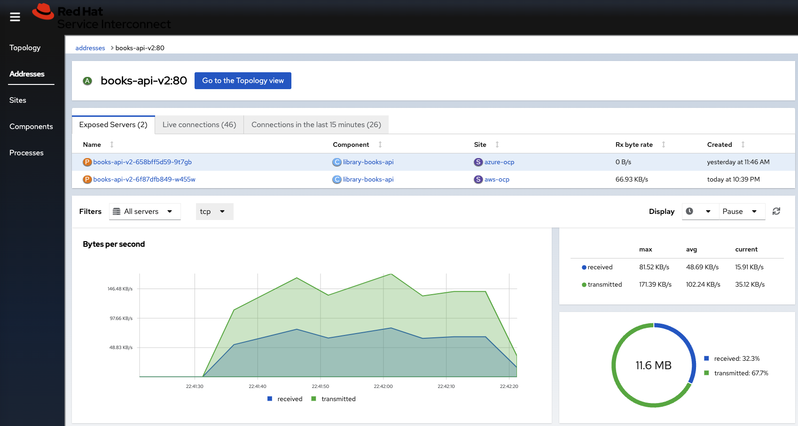
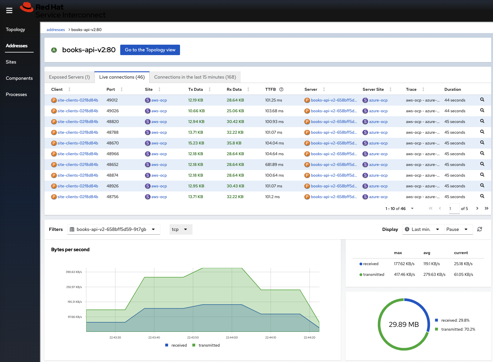
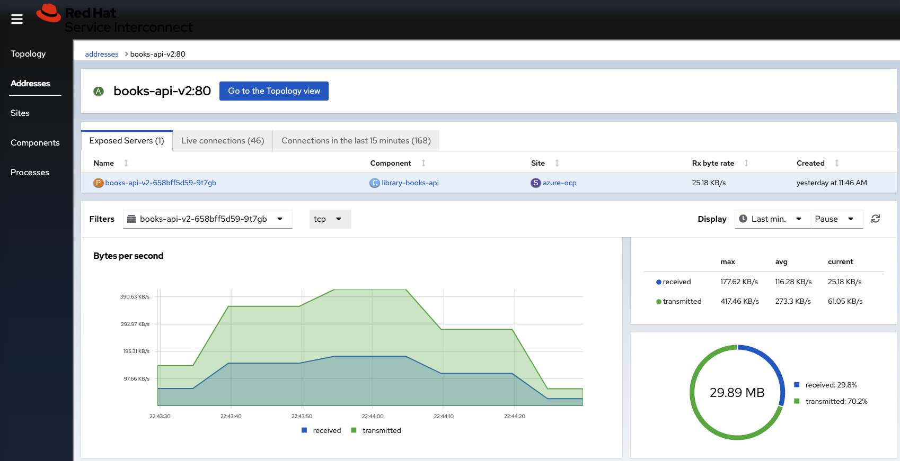

# RHSI Hackfest Nov 14-16 2023 

## Securing and exposing APIs deployed across multiple environments/locations using Red Hat 3scale API Management and Red Hat Service Interconnect

### Overview

Red Hat 3scale API Management solution has two main components:
- The **API Manager** used for API management policy configuration
- The **API Gateway** that executes the API management policies.

The following diagram shows a multi-cluster/sites deployment configuration that is possible out of the box for Red Hat 3scale API Management/


- The 3scale API Manager component can only be active (primary) in one OpenShift cluster
- The 3scale API Gateways can be deployed anywhere. However, this requires a global load-balancer if multiple instances of the same API are deployed across multiple environments.

Red Hat Service Interconnect can be leveraged in order to easily secure multiple instances of an API that are deployed across multiple environments. For instance:


### Expectations

1. As long as all API instances in the same OCP cluster as the 3scale API Gateway are up and running, all requests must be routed to these local instances to reduce latency.

    

2. All requests that are authorized by the 3scale API Gateway should ONLY be routed to the remote OCP cluster when all local API instances are down. This will showcase the secured API service resiliency and high availability.

    

## Instructions 

### I. Prepare :cloud: AWS Cloud environment

#### Prerequisites

- [Red Hat OpenShift v4.12+](https://access.redhat.com/products/openshift/)
- [Skupper CLI](https://access.redhat.com/documentation/en-us/red_hat_service_interconnect/1.4/html/installation/installing-skupper-cli). 
    >NOTE:  [Skupper CLI v1.4.2-rh-1](https://access.redhat.com/documentation/en-us/red_hat_service_interconnect/1.4/html/installation/installing-skupper-cli) has been used in the following instructions.

#### Deploy the _Library Books API_ backend services

1. Create the `rhsi-hackfest-apibackend` namespace:
    ```
    oc apply -f ./ThreescaleAPIProducts/library-books-api/openshift_manifests/rhsi-hackfest-apibackend_namespace.yaml
    ```

2. Edit the _Library Books API_ services configMaps in the [`./ThreescaleAPIProducts/library-books-api/openshift_manifests/books-api-v1.yaml`](./ThreescaleAPIProducts/library-books-api/openshift_manifests/books-api-v1.yaml) and [`./ThreescaleAPIProducts/library-books-api/openshift_manifests/books-api-v2.yaml`](./ThreescaleAPIProducts/library-books-api/openshift_manifests/books-api-v2.yaml) manifests to replace the OpenShift domain placeholder with that of your cluster:

    > NOTE: This sets the URL to the Jaeger server collector for distributed tracing.
    
    ```script shell
    sed 's/apps.*com/<Replace with your OpenShift cluster application domain URI>/g' ./ThreescaleAPIProducts/library-books-api/openshift_manifests/books-api-v1.yaml > temp.yml && mv temp.yml ./ThreescaleAPIProducts/library-books-api/openshift_manifests/books-api-v1.yaml
    
    sed 's/apps.*com/<Replace with your OpenShift cluster application domain URI>/g' ./ThreescaleAPIProducts/library-books-api/openshift_manifests/books-api-v2.yaml > temp.yml && mv temp.yml ./ThreescaleAPIProducts/library-books-api/openshift_manifests/books-api-v2.yaml
    ```

    Example:

    ```script shell
    sed 's/apps.*com/apps.cluster-8bcs7.8bcs7.sandbox2056.opentlc.com/g' ./ThreescaleAPIProducts/library-books-api/openshift_manifests/books-api-v1.yaml > temp.yaml && mv temp.yaml ./ThreescaleAPIProducts/library-books-api/openshift_manifests/books-api-v1.yaml
    
    sed 's/apps.*com/apps.cluster-8bcs7.8bcs7.sandbox2056.opentlc.com/g' ./ThreescaleAPIProducts/library-books-api/openshift_manifests/books-api-v2.yaml > temp.yaml && mv temp.yaml ./ThreescaleAPIProducts/library-books-api/openshift_manifests/books-api-v2.yaml
    ```

3. Deploy the _Library Books API_ service to be secured by 3scale:
    ```
    oc -n rhsi-hackfest-apibackend apply -f ./ThreescaleAPIProducts/library-books-api/openshift_manifests/books-api-v1.yaml
    oc set env deploy/books-api-v1 DEPLOYMENT_LOCATION="OpenShift on AWS Cloud"
    oc -n rhsi-hackfest-apibackend apply -f ./ThreescaleAPIProducts/library-books-api/openshift_manifests/books-api-v2.yaml
    oc set env deploy/books-api-v2 DEPLOYMENT_LOCATION="OpenShift on AWS Cloud"
    ```

#### Install Red Hat 3scale API Management v2.13

1. Change to the `./install/3scale-amp` directory:

    ```script shell
    cd ./install/3scale-amp
    ```

2. Follow these [instructions](./install/3scale-amp/README.md).

#### Install Red Hat OpenShift distributed tracing platform for observability

1. Change to the `./install/Observability` directory:

    ```script shell
    cd ./install/Observability
    ```

2. Follow these [instructions](./install/Observability/README.md).

#### Secure the _Library Books API_ with Red Hat 3scale API Management

1. Change to the `./ThreescaleAPIProducts` directory:

    ```script shell
    cd ./ThreescaleAPIProducts
    ```

2. Follow these [instructions](./ThreescaleAPIProducts/README.md).

### II. Prepare :cloud: AZURE Cloud environment

#### Prerequisites

- [Red Hat OpenShift v4.12+](https://access.redhat.com/products/openshift/)
- [Skupper CLI](https://access.redhat.com/documentation/en-us/red_hat_service_interconnect/1.4/html/installation/installing-skupper-cli). 
    >NOTE:  [Skupper CLI v1.4.2-rh-1](https://access.redhat.com/documentation/en-us/red_hat_service_interconnect/1.4/html/installation/installing-skupper-cli) has been used in the following instructions.

#### Deploy the _Library Books API_ backend services

1. Create the `rhsi-hackfest-apibackend` namespace:
    ```
    oc apply -f ./ThreescaleAPIProducts/library-books-api/openshift_manifests/rhsi-hackfest-apibackend_namespace.yaml
    ```

2. Deploy the _Library Books API_ service to be secured by 3scale:
    ```
    oc -n rhsi-hackfest-apibackend apply -f ./ThreescaleAPIProducts/library-books-api/openshift_manifests/books-api-v1.yaml
    oc set env deploy/books-api-v1 DEPLOYMENT_LOCATION="OpenShift on AZURE Cloud"
    oc -n rhsi-hackfest-apibackend apply -f ./ThreescaleAPIProducts/library-books-api/openshift_manifests/books-api-v2.yaml
    oc set env deploy/books-api-v2 DEPLOYMENT_LOCATION="OpenShift on AZURE Cloud"
    ```

### III. Configure the RHSI network

#### :cloud: AWS Cloud Red Hat Service Interconnect Router

1. Login to the AWS OCP cluster
    ```shell script
    oc login...
    ```

2. Make sure the current project is `rhsi-hackfest-apibackend`
    ```shell script
    oc project rhsi-hackfest-apibackend
    ```

3. Initialize the Service Interconnect Router.
    > NOTE: This should install the Service Interconnect resources in the rhsi-hackfest-apibackend namespace of the AWS OCP cluster 
    ```shell script
    skupper init --enable-console --enable-flow-collector --console-auth unsecured --site-name aws-ocp
    ```

4. See the status of the skupper network
    ```shell script
    skupper status
    ```

5. Expose the `books-api-v1` and `books-api-v2` services over the link

    ```shell script
    skupper expose deployment/books-api-v1 --address books-api-v1 --port 80 --target-port 8080 --protocol tcp
    skupper expose deployment/books-api-v2 --address books-api-v2 --port 80 --target-port 8080 --protocol tcp
    ```

6. Create a token in the AWS OCP cluster namespace that will be used to create the link with the AZURE OCP cluster namespace
    ```shell script
    skupper token create secret_aws_azure.token
    ```

#### :cloud: AZURE Cloud Red Hat Service Interconnect Router

1. login to the AZURE OCP cluster
    ```shell script
    oc login...
    ```

2. Make sure the current project is `rhsi-hackfest-apibackend`
    ```shell script
    oc project rhsi-hackfest-apibackend
    ```

3. Initialize the Service Interconnect Router.
    > NOTE: This should install the Service Interconnect resources in the rhsi-hackfest-apibackend namespace of the AZURE OCP cluster 
    ```shell script
    skupper init --site-name azure-ocp
    ```

4. Use the previously created AWS token file to create a link between the `rhsi-hackfest-apibackend` namespaces on AWS and AZURE OCP clusters
    >NOTE: /!\ Beware, the token is only usable once. Plus, it expires after 15mn if not used.
    ```shell script
    skupper link create ./secret_aws_azure.token --name azure-to-aws --cost 99999
    ```

6. Expose the `books-api-v1` and `books-api-v2` services over the link
    ```shell script
    skupper expose deployment/books-api-v1 --address books-api-v1 --port 80 --target-port 8080 --protocol tcp
    skupper expose deployment/books-api-v2 --address books-api-v2 --port 80 --target-port 8080 --protocol tcp
    ```

### IV. Tests

#### Prerequisites

- All the above steps have been completed
- The [`hey CLI`](https://github.com/rakyll/hey) has been used to generate load on the secured API services

#### Verify local AWS API service is favored when both AWS and AZURE services are running

> NOTE: `${OCP_DOMAIN}` environment variable represents the application domain of your Red Hat OpenShift cluster hosting the 3scale API Management platform on AWS cloud.

1. Generate some HTTP requests load on the `/v2/books` endpoint using 50 worker threads for 30 seconds:
    ```script shell
    hey -c 50 -z 30s -m GET \
    -H 'app_id: rhsi-hackfest-test-v2' \
    -H 'app_key: 5fe5567a17d58bcf25f935cf517433f0' \
    https://library-books-api-rhsi-hackfest-apicast-production.${OCP_DOMAIN}/v2/books
    ```

2. The Skupper web console shows that all traffic goes to `aws-ocp` RHSI site (local)

    

    - All authorized HTTP requests are handled by the `aws-ocp` (local) server site.

    

#### Verify resilience and remote access when AWS API service are not running

> NOTE: `${OCP_DOMAIN}` environment variable represents the application domain of your Red Hat OpenShift cluster hosting the 3scale API Management platform on AWS cloud.

1. Scale down to zero the _Library Books API_ services deployed on AWS cloud:

    1. Login to the AWS OCP cluster
        ```shell script
        oc login...
        ```
    2. Make sure the current project is `rhsi-hackfest-apibackend`
        ```shell script
        oc project rhsi-hackfest-apibackend
        ```

    3. Stop the _Library Books API_ services
        ```shell script
        oc scale --replicas=0 deploy/books-api-v1 deploy/books-api-v2
        ```

2. Generate some HTTP requests load on the `/v2/books` endpoint using 50 worker threads for 30 seconds:
    ```script shell
    hey -c 50 -z 30s -m GET \
    -H 'app_id: rhsi-hackfest-test-v2' \
    -H 'app_key: 5fe5567a17d58bcf25f935cf517433f0' \
    https://library-books-api-rhsi-hackfest-apicast-production.${OCP_DOMAIN}/v2/books
    ```

3. The Skupper web console shows that all traffic goes to `aws-azure` RHSI site (local)

    
        
    - All authorized HTTP requests are handled by the `aws-azure` (remote) server site.

    
