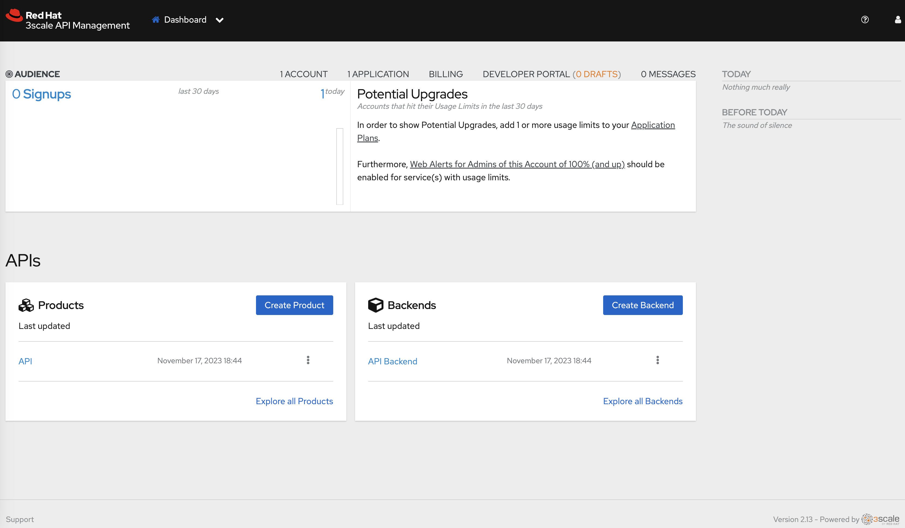
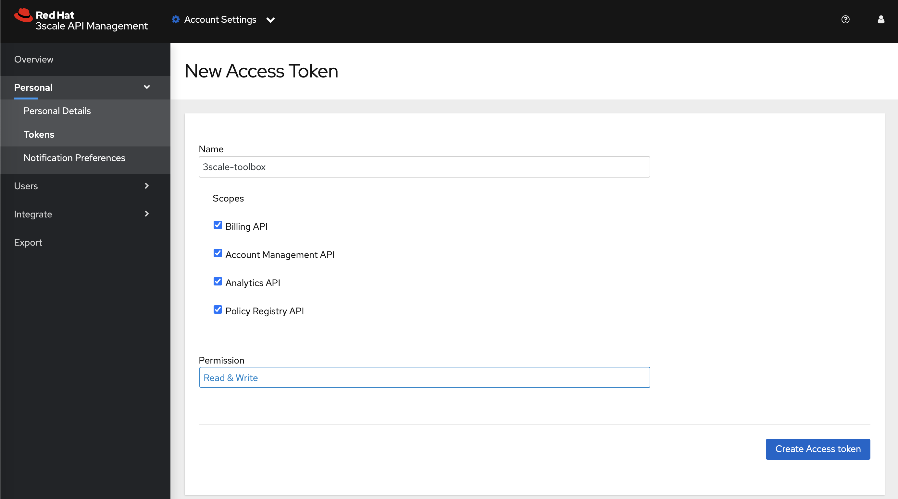
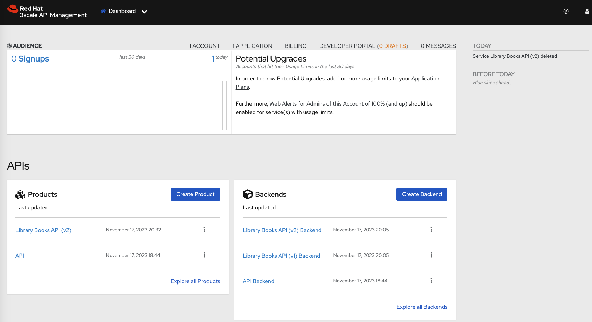

# ThreescaleAPIProducts

## Purpose of this repository

This repository contains instructions used to secure the _Library Books API_ with Red Hat 3scale API Management. Some instructions involve the Red Hat 3scale Toolbox CLI using Podman.

## Prerequisites

- [Red Hat OpenShift v4.12+](https://access.redhat.com/products/openshift/)
- [Red Hat 3scale API Management platform v2.13+](https://access.redhat.com/products/red-hat-3scale/) is installed. Install instructions can be found [here](../install/3scale-amp/README.md).

## Instructions 

### I. Create the _rhsi-hackfest_ 3scale tenant that will be used to secure the _Library Books API_ services

> NOTE: 3scale operator capabilities are leveraged in these instructions.

1. Make sure you are in the `rhsi-hackfest-3scale-amp` OpenShift project where the 3scale API Management platform has been installed.
    ```script shell
    oc project rhsi-hackfest-3scale-amp
    ```

2. Create a secret which has the password that will be used to login to the tenant. 3scale operator will use this secret to set up the login credentials of the tenants.
    ```script shell
    oc apply -f ./threescale-tenant/tenant-password-secret.yaml
    ```

3. Create the `rhsi-hackfest` 3scale tenant

    1. Edit the 3scale Tenant CR ([`./threescale-tenant/tenant-rhsi-hackfest.yaml`](./threescale-tenant/tenant-rhsi-hackfest.yaml)) to replace the OpenShift domain placeholder with that of your cluster:
    
        ```script shell
        sed 's/apps.*com/<Replace with your cluster domain URl>/g' ./threescale-tenant/tenant-rhsi-hackfest.yaml > temp.yml && mv temp.yml ./threescale-tenant/tenant-rhsi-hackfest.yaml
        ```

        Example:

        ```script shell
        sed 's/apps.*com/apps.cluster-8bcs7.8bcs7.sandbox2056.opentlc.com/g' ./threescale-tenant/tenant-rhsi-hackfest.yaml > temp.yaml && mv temp.yaml ./threescale-tenant/tenant-rhsi-hackfest.yaml
        ```

    2. Create the 3scale tenant:
        ```script shell
        oc apply -f ./threescale-tenant/tenant-rhsi-hackfest.yaml
        ```

The 3scale `rhsi-hackfest` Admin Portal is then available at `https://rhsi-hackfest-admin.apps.${OCP_DOMAIN}` where:
    - `${OCP_DOMAIN}`: the application domain of your Red Hat OpenShift cluster.



### II. Setup the 3scale-toolbox CLI

#### Prerequisites

- [Podman v4+](https://access.redhat.com/documentation/en-us/red_hat_enterprise_linux/9/html/building_running_and_managing_containers/index)
    > **NOTE:** [Podman](https://access.redhat.com/documentation/en-us/red_hat_enterprise_linux/9/html/building_running_and_managing_containers/index) must have the credentials to connect to the public Red Hat container registry ([registry.redhat.io](registry.redhat.io)) in order to pull the [3scale Toolbox image](https://catalog.redhat.com/software/containers/3scale-amp2/toolbox-rhel8/60ddc3173a73378722213e7e?container-tabs=gti&gti-tabs=registry-tokens).
    - See https://docs.podman.io/en/latest/markdown/podman-login.1.html
    - See https://access.redhat.com/terms-based-registry/ to create the service account associated with your Red Hat customer account.
- Access Token with read-write permissions on all scopes of the `rhsi-hackfest` 3scale tenant.

    > NOTE: Use the `rhsi-hackfest` tenant Admin Portal to create the access token. Menu: _Account Settings -> Personal -> Tokens -> Add access token_

    

#### :bulb: Notes

The following environment variables are used in the scope of these instructions. Please, do set them according to your Red Hat 3scale environment.

- `ABSOLUTE_BASE_PATH`: absolute path to the working directory where you cloned this repository
- `OCP_DOMAIN`: the application domain of the Red Hat OpenShift cluster hosting the 3scale API Manager.
- `THREESCALE_TENANT`: name of the remote 3scale API Manager tenant
- `THREESCALE_TENANT_ACCESS_TOKEN`: access token with read-write permissions on all scopes of the remote 3scale API Manager tenant.
- `THREESCALE_TENANT_ADMIN_PORTAL_HOSTNAME`: FQDN of the remote 3scale API Manager tenant.
- `THREESCALE_TOOLBOX_DESTINATION`: name of the remote 3scale API Manager tenant registered in the 3scale Toolbox CLI

1. Set the following environment variables according to your 3scale environment. Example:
    ```script shell
    export ABSOLUTE_BASE_PATH=/home/lab-user
    export OCP_DOMAIN=apps.<change_me>
    export THREESCALE_TENANT=rhsi-hackfest
    export THREESCALE_TENANT_ACCESS_TOKEN=<change_me>
    export THREESCALE_TENANT_ADMIN_PORTAL_HOSTNAME=${THREESCALE_TENANT}-admin.${OCP_DOMAIN}
    export THREESCALE_TOOLBOX_DESTINATION=rhsi-hackfest-tenant
    ```

2. Create a named container that contains the remote 3scale tenant connection credentials.
    ```script shell
    podman run --name 3scale-toolbox-original \
    registry.redhat.io/3scale-amp2/toolbox-rhel8:3scale2.13 3scale remote \
    add ${THREESCALE_TOOLBOX_DESTINATION} https://${THREESCALE_TENANT_ACCESS_TOKEN}@${THREESCALE_TENANT_ADMIN_PORTAL_HOSTNAME}
    ```

3. Use `podman commit` to create a new image, `3scale-toolbox-demo`, from the named container. 
    > **NOTE**: Because the previous created container holds the remote information, the new image contains it too.
    ```script shell
    podman commit 3scale-toolbox-original 3scale-toolbox
    ```

4. Create a bash alias to run the [Red Hat 3scale Toolbox CLI](https://access.redhat.com/documentation/en-us/red_hat_THREESCALE_api_management/2.13/html/operating_3scale/the-threescale-toolbox#doc-wrapper) using the `3scale-toolbox-demo` container image.

    ```script shell
    alias 3scale="podman run --rm 3scale-toolbox 3scale -k"
    ```

### III. Secure the _Library Books API_ services using Red Hat 3scale API Management

> **NOTE**: Both versions `v1` and `v2` are bundled and exposed as a single API product _Library Books API v2_

1. Login into the OpenShift cluster where [Red Hat 3scale API Management v2.13](https://access.redhat.com/products/red-hat-3scale/) is deployed. It should be on :cloud: AWS cloud.
    ```script shell
    oc login...
    ```

2. Make sure the current OpenShift project is `rhsi-hackfest-3scale-amp`:
    ```shell script
    oc project rhsi-hackfest-3scale-amp
    ```

3. Using the 3scale operator capabilities, secure the _Library Books API_ services using the `rhsi-hackfest` 3scale tenant:

    1. Create the 3scale API backend objects:
        ```script shell
        oc apply -n rhsi-hackfest-3scale-amp \
        -f ./library-books-api/threescale/backends/books-api-v1.yaml \
        -f ./library-books-api/threescale/backends/books-api-v2.yaml
        ```

    2. Create the 3scale API product object with its security configuration and policies:
        ```script shell
        oc apply -n rhsi-hackfest-3scale-amp \
        -f ./library-books-api/threescale/products/library-books-api.yaml
        ```

    3. Create the 3scale activedoc object for the _Library Books API_ API product:
        ```script shell
        oc apply -n rhsi-hackfest-3scale-amp \
        -f ./library-books-api/threescale/activedocs/library-books-api.yaml
        ```

    4. Promote the configuration to 3scale staging environment:
        ```script shell
        oc apply -n rhsi-hackfest-3scale-amp \
        -f ./library-books-api/threescale/proxyconfigs/library-books-api_promotetostaging.yaml
        ```

    You can explore the _Library Books API_ API product configuration through the `rhsi-hackfest` tenant Admin Portal.

    

4. Using the [Red Hat 3scale Toolbox CLI](https://access.redhat.com/documentation/en-us/red_hat_THREESCALE_api_management/2.13/html/operating_3scale/the-threescale-toolbox#doc-wrapper), create applications to test the configuration:

    - A application with the default Developer account subscribing to the service `Premium v1` plan in order to test the `v1` configuration.
        ```script shell
        3scale application create \
        --description="Developer's Application to the Library Books API (V1 testing purposes)" \
        --application-id=rhsi-hackfest-test-v1 \
        --application-key=6cb351590d24531e9ddadbd03527f66b \
        ${THREESCALE_TOOLBOX_DESTINATION} john library-books-api premium-plan-v1 "Developer's App (v1)"
        ```
    
    - A application with the default Developer account subscribing to the service `Premium v2` plan in order to test the `v2` configuration.
        ```script shell
        3scale application create \
        --description="Developer's Application to the Library Books API (V2 testing purposes)" \
        --application-id=rhsi-hackfest-test-v2 \
        --application-key=5fe5567a17d58bcf25f935cf517433f0 \
        ${THREESCALE_TOOLBOX_DESTINATION} john library-books-api premium-plan-v2 "Developer's App (v2)"
        ```

5. Perform some testing of your configuration in the 3scale staging environment.

    1. Test the `/v1/books` path with the `v1` application credentials

        > NOTE: `v2` application is not allowed to call the `/v1/books` endpoint

        - `GET` method:
            ```script shell
            http https://library-books-api-${THREESCALE_TENANT}-apicast-staging.${OCP_DOMAIN}/v1/books 'app_id: rhsi-hackfest-test-v1' 'app_key: 6cb351590d24531e9ddadbd03527f66b'
            ```

            The 3scale API gateway should reject the request.
            ```console
            HTTP/1.1 200 OK
            [...]
            deployment-location: OpenShift on AWS Cloud
            [...]

            [
                {
                    "authorName": "Mary Shelley",
                    "copies": 10,
                    "title": "Frankenstein",
                    "year": 1818
                },
                {
                    "authorName": "Charles Dickens",
                    "copies": 5,
                    "title": "A Christmas Carol",
                    "year": 1843
                },
                {
                    "authorName": "Jane Austen",
                    "copies": 3,
                    "title": "Pride and Prejudice",
                    "year": 1813
                }
            ]
            ```

        - `POST` method:
            ```script shell
            echo '{                                   
                "authorName": "Test Author",
                "copies": 100,
                "title": "Test Book",
                "year": 2023
            }' | http https://library-books-api-${THREESCALE_TENANT}-apicast-staging.${OCP_DOMAIN}/v1/books 'app_id: rhsi-hackfest-test-v1' 'app_key: 6cb351590d24531e9ddadbd03527f66b' "Content-type: application/json"
            ```

            The 3scale API gateway should reject the request.
            ```console
            HTTP/1.1 403 Forbidden
            [...]
            deployment-location: OpenShift on AWS Cloud
            [...]

            [
                {
                    "authorName": "Mary Shelley",
                    "copies": 10,
                    "title": "Frankenstein",
                    "year": 1818
                },
                {
                    "authorName": "Charles Dickens",
                    "copies": 5,
                    "title": "A Christmas Carol",
                    "year": 1843
                },
                {
                    "authorName": "Jane Austen",
                    "copies": 3,
                    "title": "Pride and Prejudice",
                    "year": 1813
                },
                {
                    "authorName": "Test Author",
                    "copies": 100,
                    "title": "Test Book",
                    "year": 2023
                }
            ]
            ```

    2. Test the `/v2/books` path with the `v2` application credentials

        > NOTE: `v1` application is not allowed to call the `/v2/books` endpoint

        - `GET` method:
            ```script shell
            http https://library-books-api-${THREESCALE_TENANT}-apicast-staging.${OCP_DOMAIN}/v2/books 'app_id: rhsi-hackfest-test-v2' 'app_key: 5fe5567a17d58bcf25f935cf517433f0'
            ```

            The 3scale API gateway should reject the request.
            ```console
            HTTP/1.1 200 OK
            [...]
            deployment-location: OpenShift on AWS Cloud
            [...]

            [
                {
                    "author": {
                        "birthDate": "1797-08-30T00:00:00.000Z",
                        "name": "Mary Shelley"
                    },
                    "copies": 10,
                    "title": "Frankenstein",
                    "year": 1818
                },
                {
                    "author": {
                        "birthDate": "1812-02-07T00:00:00.000Z",
                        "name": "Charles Dickens"
                    },
                    "copies": 5,
                    "title": "A Christmas Carol",
                    "year": 1843
                },
                {
                    "author": {
                        "birthDate": "1775-12-16T00:00:00.000Z",
                        "name": "Jane Austen"
                    },
                    "copies": 3,
                    "title": "Pride and Prejudice",
                    "year": 1813
                }
            ]
            ```

        - `POST` method:
            ```script shell
            echo '{
                "author": {
                    "birthDate": "1642-12-25T00:00:00.000Z",
                    "name": "Sir Isaac Newton"
                },
                "copies": 31,
                "title": "Philosophiæ Naturalis Principia Mathematica",
                "year": 1687
            }' | http https://library-books-api-${THREESCALE_TENANT}-apicast-staging.${OCP_DOMAIN}/v2/books 'app_id: rhsi-hackfest-test-v2' 'app_key: 5fe5567a17d58bcf25f935cf517433f0' "Content-type: application/json"
            ```

            The 3scale API gateway should reject the request.
            ```console
            HTTP/1.1 403 Forbidden
            [...]
            deployment-location: OpenShift on AWS Cloud
            [...]

            [
                {
                    "author": {
                        "birthDate": "1797-08-30T00:00:00.000Z",
                        "name": "Mary Shelley"
                    },
                    "copies": 10,
                    "title": "Frankenstein",
                    "year": 1818
                },
                {
                    "author": {
                        "birthDate": "1812-02-07T00:00:00.000Z",
                        "name": "Charles Dickens"
                    },
                    "copies": 5,
                    "title": "A Christmas Carol",
                    "year": 1843
                },
                {
                    "author": {
                        "birthDate": "1775-12-16T00:00:00.000Z",
                        "name": "Jane Austen"
                    },
                    "copies": 3,
                    "title": "Pride and Prejudice",
                    "year": 1813
                },
                {
                    "author": {
                        "birthDate": "1642-12-25T00:00:00.000Z",
                        "name": "Sir Isaac Newton"
                    },
                    "copies": 31,
                    "title": "Philosophiæ Naturalis Principia Mathematica",
                    "year": 1687
                }
            ]
            ```

6. After performing some tests of your configuration in the 3scale staging environment, you can now promote the latest staging Proxy Configuration to the 3scale production environment.
    ```script shell
    oc apply -n rhsi-hackfest-3scale-amp \
    -f ./library-books-api/threescale/proxyconfigs/library-books-api_promotetoprod.yaml
    ```