# ThreescaleAPIProducts

## Purpose of this repository

This repository contains demo instructions for setting up and running the [Red Hat 3scale Toolbox CLI](https://access.redhat.com/documentation/en-us/red_hat_THREESCALE_api_management/2.13/html/operating_3scale/the-threescale-toolbox#doc-wrapper) using [Podman](https://access.redhat.com/documentation/en-us/red_hat_enterprise_linux/9/html/building_running_and_managing_containers/index). 

The [Red Hat 3scale Toolbox CLI](https://access.redhat.com/documentation/en-us/red_hat_THREESCALE_api_management/2.13/html/operating_3scale/the-threescale-toolbox#doc-wrapper) is then used to secure the [Library Books API](./library-books-api/) with a Red Hat 3scale API Management tenant. Some instructions involve the _3scale Admin Portal_ UI.

Red Hat 3scale Toolbox **v2.13** is used in these instructions.

## Prerequisites

- [Red Hat OpenShift v4.10+](https://access.redhat.com/products/openshift/) with [Red Hat 3scale v2.13+](https://access.redhat.com/products/red-hat-3scale/) installed
- [Red Hat Single Sign-On v7.6](https://access.redhat.com/products/red-hat-single-sign-on/)
- [Podman v4+](https://access.redhat.com/documentation/en-us/red_hat_enterprise_linux/9/html/building_running_and_managing_containers/index) v4+
    > **NOTE:** [Podman](https://access.redhat.com/documentation/en-us/red_hat_enterprise_linux/9/html/building_running_and_managing_containers/index) must have the credentials to connect to the public Red Hat container registry ([registry.redhat.io](registry.redhat.io)) in order to pull the [3scale Toolbox image](https://catalog.redhat.com/software/containers/3scale-amp2/toolbox-rhel8/60ddc3173a73378722213e7e?container-tabs=gti&gti-tabs=registry-tokens).
    - The `podman login` command can generate a file with credentials (`${XDG_RUNTIME_DIR}/containers/auth.json`). Example: `podman login registry.redhat.io` and then enter the service account credentials to connect.
    - See https://docs.podman.io/en/latest/markdown/podman-login.1.html
    - See https://access.redhat.com/terms-based-registry/ to create the service account associated with your Red Hat customer account.
- Access Token with read-write permissions on all scopes of your Red Hat 3scale API Manager tenant.

    

## Instructions 

### :bulb: Notes

The following environment variables are used in the scope of these instructions. Please, do set them according to your Red Hat 3scale environment.

- `ABSOLUTE_BASE_PATH`: absolute path to the working directory where you cloned this repository
- `OCP_DOMAIN`: the application domain of the Red Hat OpenShift cluster hosting the 3scale API Manager.
- `RH_SSO_HOSTNAME`: FQDN of the Red Hat Single Sign-On instance.
- `RH_SSO_THREESCALE_ZYNC_SECRET`: secret of the `threescale-zync` client in Red Hat Single Sign-On. This client is used by the remote 3scale API Manager tenant to dynamically register and synchonize the service application credentials.
- `THREESCALE_TENANT`: name of the remote 3scale API Manager tenant
- `THREESCALE_TENANT_ACCESS_TOKEN`: access token with read-write permissions on all scopes of the remote 3scale API Manager tenant.
- `THREESCALE_TENANT_ADMIN_PORTAL_HOSTNAME`: FQDN of the remote 3scale API Manager tenant.
- `THREESCALE_TOOLBOX_DESTINATION`: name of the remote 3scale API Manager tenant registered in the 3scale Toolbox CLI

### I. Deploy the _Library Books API_ backend services

1. Create the `rhsi-hackfest-apibackend` namespace:
    ```
    oc apply -f library-books-api/openshift_manifests/rhsi-hackfest-apibackend_namespace.yaml
    ```

2. Deploy the _Library Books API_ service to be secured by 3scale:
    ```
    oc -n rhsi-hackfest-apibackend apply -f library-books-api/openshift_manifests/books-api-v1.yaml
    oc -n rhsi-hackfest-apibackend apply -f library-books-api/openshift_manifests/books-api-v2.yaml
    ```

### II. Setup the 3scale-toolbox CLI

1. Set the following environment variables according to your 3scale environment. Example:
    ```script shell
    export ABSOLUTE_BASE_PATH=/home/lab-user
    export OCP_DOMAIN=apps.<change_me>
    export THREESCALE_TENANT=rhsi-hackfest
    export THREESCALE_TENANT_ACCESS_TOKEN=<change_me>
    export THREESCALE_TENANT_ADMIN_PORTAL_HOSTNAME=${THREESCALE_TENANT}-admin.${OCP_DOMAIN}
    export THREESCALE_TOOLBOX_DESTINATION=rhsi-hackfest-tenant
    ```

2. Create a named container that contains the remote 3scale tenant connection credentials.
    ```script shell
    podman run --name 3scale-toolbox-original \
    registry.redhat.io/3scale-amp2/toolbox-rhel8:3scale2.13 3scale remote \
    add ${THREESCALE_TOOLBOX_DESTINATION} https://${THREESCALE_TENANT_ACCESS_TOKEN}@${THREESCALE_TENANT_ADMIN_PORTAL_HOSTNAME}
    ```

3. Use `podman commit` to create a new image, `3scale-toolbox-demo`, from the named container. 
    > **NOTE**: Because the previous created container holds the remote information, the new image contains it too.
    ```script shell
    podman commit 3scale-toolbox-original 3scale-toolbox-demo
    ```

4. Create a bash alias to run the [Red Hat 3scale Toolbox CLI](https://access.redhat.com/documentation/en-us/red_hat_THREESCALE_api_management/2.13/html/operating_3scale/the-threescale-toolbox#doc-wrapper) using the `3scale-toolbox-demo` container image.

    > **NOTE**: The `library-books-api` 3scale resources are also mounted into the container at run-time

    ```script shell
    alias 3scale="podman run --rm -v ${ABSOLUTE_BASE_PATH}/rhsi-hackfest-nov2023/ThreescaleAPIProducts/library-books-api:/tmp/toolbox/library-books-api:Z 3scale-toolbox-demo 3scale -k"
    ```

### III. Secure the _Library Books API v1_ using Red Hat 3scale API Management with OpenID Connect

1. Import the [`rhsi-hackfest` realm](./rhsso-realm/rhsi-hackfest_realm-export.json) in your [Red Hat Single Sign-On v7.6](https://access.redhat.com/products/red-hat-single-sign-on/) instance.

    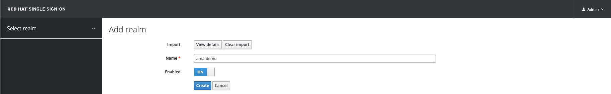

    > **NOTE**: The `threscale-zync` client is already provisioned in the `toolbox-demo` realm. Regenerate the client secret as it will be used in the following instructions.

    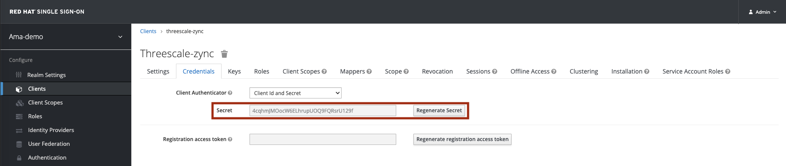

2. Set the following environment variables according to your Red Hat Single Sign-On environment. Example:
    ```script shell
    export RH_SSO_HOSTNAME=<change_me>
    export RH_SSO_THREESCALE_ZYNC_SECRET=<change_me>
    ```

3. Import the _Library Books API v1_ in 3scale using its OpenAPI specification.

    ```script shell
    3scale import openapi \
    --override-private-base-url="http://books-api-v1.rhsi-hackfest-apibackend.svc.cluster.local/api/v1" \
    --oidc-issuer-type=keycloak \
    --oidc-issuer-endpoint="https://threescale-zync:${RH_SSO_THREESCALE_ZYNC_SECRET}@${RH_SSO_HOSTNAME}/auth/realms/rhsi-hackfest" \
    --target_system_name=library-books-api \
    -d ${THREESCALE_TOOLBOX_DESTINATION} /tmp/toolbox/library-books-api/threescale/openapi/LibraryBooksAPI_v1.yaml
    ```

    After importing, you should find the _Library Books API_ product and backend objects on the 3scale Admin Portal dashboard.

    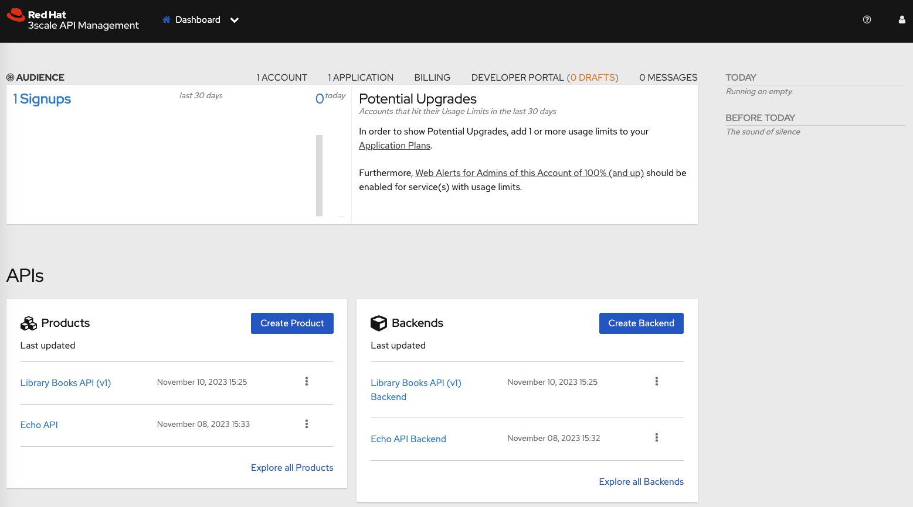

    You can drill down into the details of each object to verify all the configurations that have been automatically applied based on the OpenAPI specification. For instance, the 3scale API product mapping rules.

    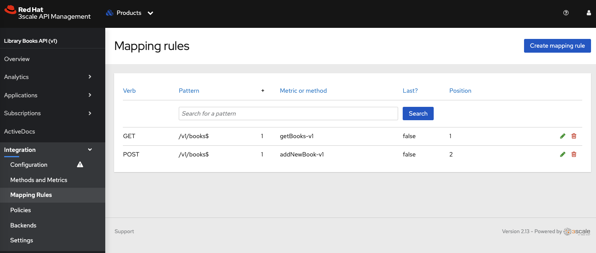

4. Import the application plans.

    - `Basic v1` plan 
        ```script shell
        3scale application-plan import \
        --file=/tmp/toolbox/library-books-api/threescale/application_plans/basic-v1-plan.yaml \
        ${THREESCALE_TOOLBOX_DESTINATION} library-books-api
        ```

    - `Premium v1` plan
        ```script shell
        3scale application-plan import \
        --file=/tmp/toolbox/library-books-api/threescale/application_plans/premium-v1-plan.yaml \
        ${THREESCALE_TOOLBOX_DESTINATION} library-books-api
        ```

    After importing, you should find the `Basic v1` and `Premium v1` plans on the _Library Books API (v1)_ product page of the 3scale Admin Portal.

    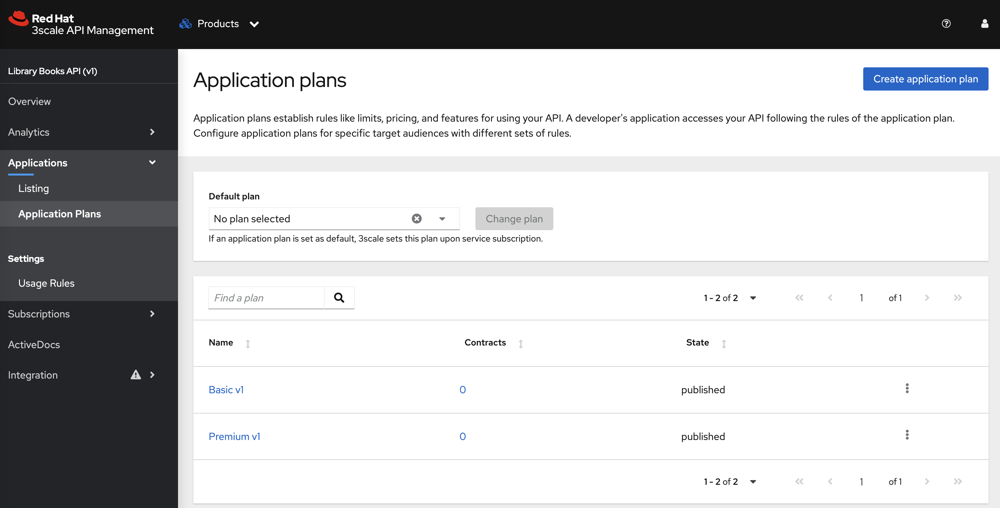

    You can drill down into the details of each application plan to verify the configurations that has been applied. For instance, the details of the `Basic v1` are shown below.

    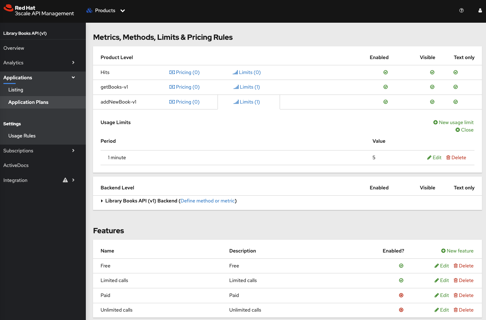

5. Import the policy chain. 
    ```script shell
    3scale policies import \
    --file=/tmp/toolbox/library-books-api/threescale/policies/policy_chain.yaml \
    ${THREESCALE_TOOLBOX_DESTINATION} library-books-api
    ```
    The following policies will be configured on the _Library Books API product_ in that order:
    - [CORS Request Handling](https://access.redhat.com/documentation/en-us/red_hat_3scale_api_management/2.13/html/administering_the_api_gateway/apicast-policies#cors_standard-policies)
    - [3scale Auth Caching](https://access.redhat.com/documentation/en-us/red_hat_3scale_api_management/2.13/html/administering_the_api_gateway/apicast-policies#threescale-auth-caching_standard-policies)
    - [Logging](https://access.redhat.com/documentation/en-us/red_hat_3scale_api_management/2.13/html/administering_the_api_gateway/apicast-policies#logging_standard-policies)
    - [Custom Metrics](https://access.redhat.com/documentation/en-us/red_hat_3scale_api_management/2.13/html/administering_the_api_gateway/apicast-policies#custom-metrics_standard-policies) to count specific returned HTTP codes (`200`, `201`, `400`, `404` and `500`) by the upstream API backend.
    - 3scale APIcast (default policy that must note be removed).

    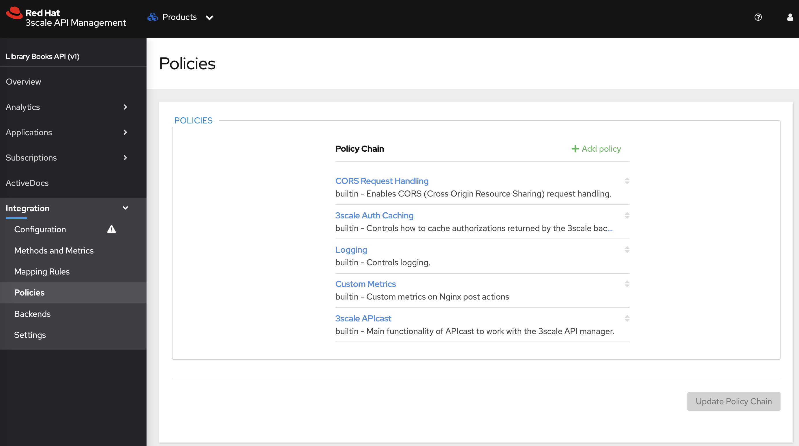

6. Create the custom metrics used the track the HTTP status codes returned by the upstream API backend:
    ```script shell
    # status-200
    3scale metric create ${THREESCALE_TOOLBOX_DESTINATION} library-books-api status-200 \
    --system-name=status-200 \
    --unit=count \
    --description="Number of 200 HTTP return codes from the upstream API backend"

    # status-201
    3scale metric create ${THREESCALE_TOOLBOX_DESTINATION} library-books-api status-201 \
    --system-name=status-201 \
    --unit=count \
    --description="Number of 201 HTTP return codes from the upstream API backend"

    # status-400
    3scale metric create ${THREESCALE_TOOLBOX_DESTINATION} library-books-api status-400 \
    --system-name=status-400 \
    --unit=count \
    --description="Number of 400 HTTP return codes from the upstream API backend"
    
    # status-404
    3scale metric create ${THREESCALE_TOOLBOX_DESTINATION} library-books-api status-404 \
    --system-name=status-404 \
    --unit=count \
    --description="Number of 404 HTTP return codes from the upstream API backend"

    # status-500
    3scale metric create ${THREESCALE_TOOLBOX_DESTINATION} library-books-api status-500 \
    --system-name=status-500 \
    --unit=count \
    --description="Number of 500 HTTP return codes from the upstream API backend"
    ```

    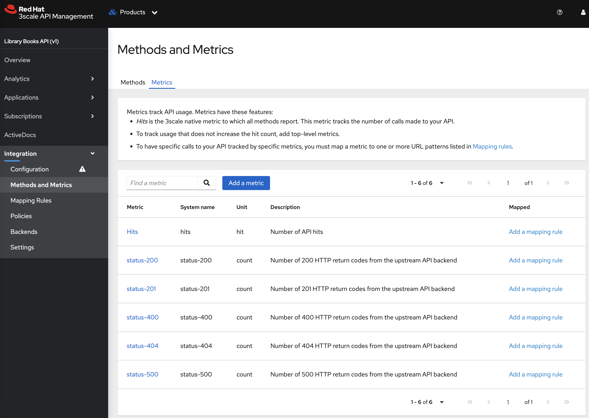

7. Use the 3scale Admin Portal UI to edit the `Public path` of the _Library Books API (v1)_ product for the _Library Books API (v1) Backend_.
    > **NOTE**: The current 3scale Toolbox CLI does not allow to update an API product `Public path`
    1. Menu: _Integration -> Backends -> Edit icon on the _Library Books API (v1) Backend_
    
    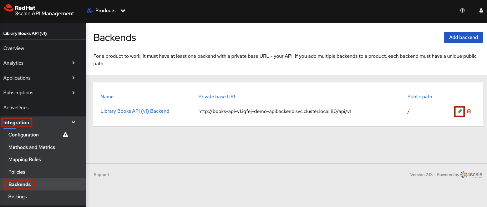

    2. Set the `Public path` to `/v1`

    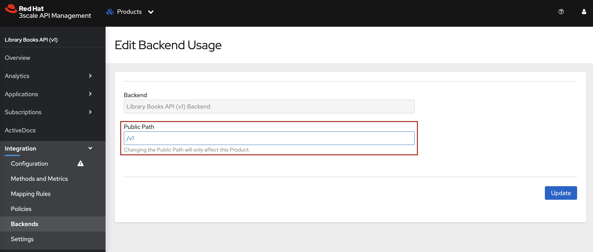

8. Additionally, use the 3scale Admin Portal UI to edit the `OIDC AUTHORIZATION FLOW` by enabling the `Service Accounts Flow` (_RH-SSO_ terminology for the OAuth 2.0 client credentials flow). Menu: _Integration -> Settings -> OIDC AUTHORIZATION FLOW section -> check Service Accounts Flow_
    > **NOTE**: This will allow to test the service using command lines from a terminal. _Authorization Code Flow_ is only for authenticating end users using a frontend application UI such as [_postman_](https://www.postman.com/downloads/) or an SPA. Do not forget to save the changes by clicking on the `Update Product` button at the bottom of the page.
    
    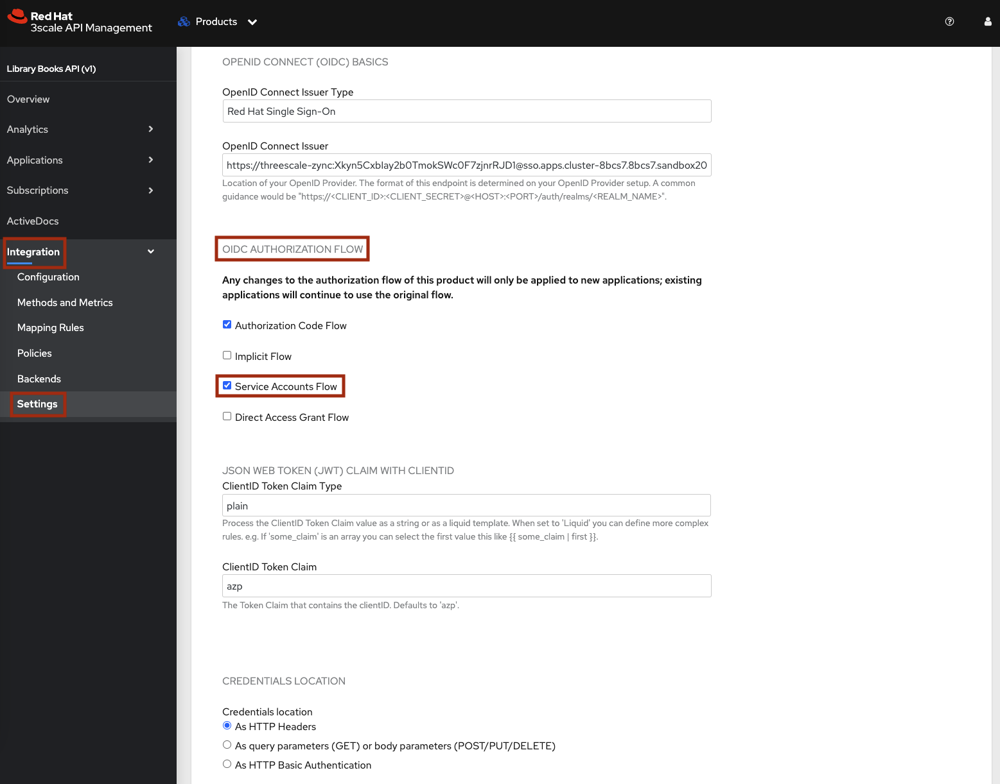

9. Promote the APIcast configuration to the Staging Environment.
    ```script shell
    3scale proxy deploy ${THREESCALE_TOOLBOX_DESTINATION} library-books-api
    ```

    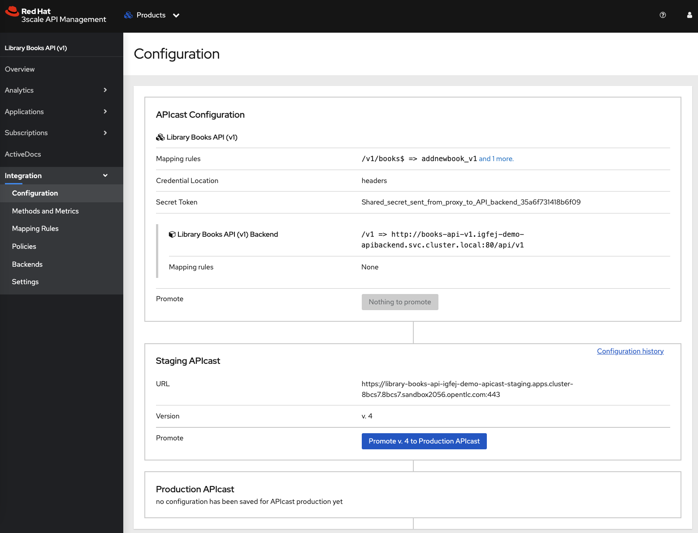

10. Create an application with the default Developer account subscribing to the service `Basic v1` plan in order to test the configuration.
    ```script shell
    3scale application create \
    --description="Developer's Application to the Library Books API (V1 testing purposes)" \
    ${THREESCALE_TOOLBOX_DESTINATION} john library-books-api basic-plan-v1 "Developer's App (v1)"
    ```

    - `Developer's App (v1)` application credentials in 3scale:

        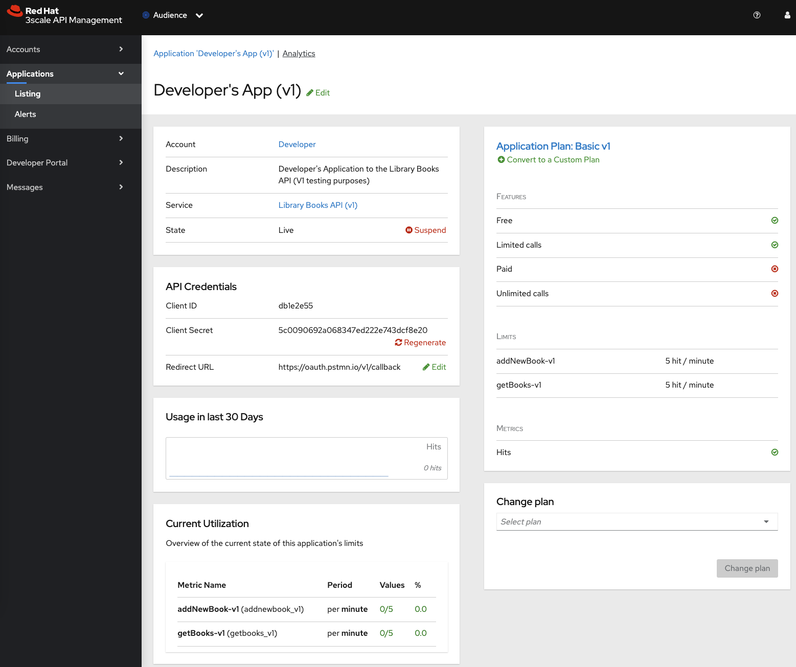

    - `Developer's App (v1)` application credentials are dynamically synchronized in Red Hat Single Sign-On:

        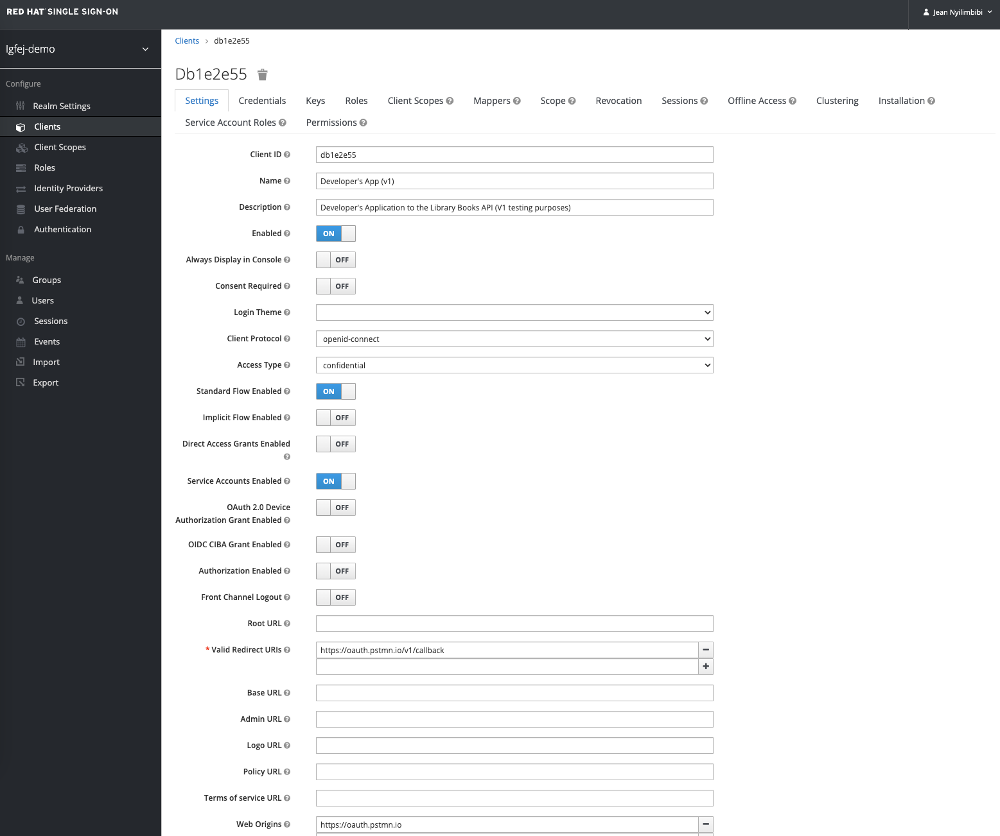

11. Perform some testing of your configuration in the 3scale staging environment.

    1. Get the OpenID Connect access token from your Red Hat Single Sign-On instance. Example using [httpie](https://httpie.io/) and [jq](https://jqlang.github.io/jq/):

        > **NOTE**: replace `client_id` and `client_secret` values with your 3scale application credentials
        ```script shell
        TOKEN=$(http --form POST \
        https://${RH_SSO_HOSTNAME}/auth/realms/rhsi-hackfest/protocol/openid-connect/token \
        grant_type="client_credentials" \
        client_id="<change_me>" \
        client_secret="<change_me>" \
        scope="openid" | jq -r .access_token) \
        && echo $TOKEN
        ```

    2. Test the `/v1/books` path

        > **NOTE**: Adjust the 3scale _Staging Public Base URL_ according to your environment.
        
        - `GET` method:

            ```script shell
            http https://library-books-api-${THREESCALE_TENANT}-apicast-staging.${OCP_DOMAIN}/v1/books "Authorization: Bearer ${TOKEN}"
            ```

            The 3scale API gateway should authorize the request.
            ```console
            HTTP/1.1 200 OK
            [...]

            [
                {
                    "authorName": "Mary Shelley",
                    "copies": 10,
                    "title": "Frankenstein",
                    "year": 1818
                },
                {
                    "authorName": "Charles Dickens",
                    "copies": 5,
                    "title": "A Christmas Carol",
                    "year": 1843
                },
                {
                    "authorName": "Charles Dickens",
                    "copies": 3,
                    "title": "Pride and Prejudice",
                    "year": 1813
                }
            ]
            ```

        - `POST` method:
        
            ```script shell
            echo '{                                   
                "authorName": "Test Author",
                "copies": 100,
                "title": "Test Book",
                "year": 2023
            }' | http https://library-books-api-${THREESCALE_TENANT}-apicast-staging.${OCP_DOMAIN}/v1/books "Authorization: Bearer ${TOKEN}" "Content-type: application/json"
            ```

            The 3scale API gateway should authorize the request.
            ```console
            HTTP/1.1 201 Created
            [...]

            [
                {
                    "authorName": "Mary Shelley",
                    "copies": 10,
                    "title": "Frankenstein",
                    "year": 1818
                },
                {
                    "authorName": "Charles Dickens",
                    "copies": 5,
                    "title": "A Christmas Carol",
                    "year": 1843
                },
                {
                    "authorName": "Jane Austen",
                    "copies": 3,
                    "title": "Pride and Prejudice",
                    "year": 1813
                },
                {
                    "authorName": "Test Author",
                    "copies": 100,
                    "title": "Test Book",
                    "year": 2023
                }
            ]
            ```

    4. Test rate limit (5 calls/mn). After 5 consecutive requests, the 3scale API gateway should reject your call.

        > **NOTE**: Adjust the 3scale _Staging Public Base URL_ according to your environment.
        ```script shell
        http https://library-books-api-${THREESCALE_TENANT}-apicast-staging.${OCP_DOMAIN}/v1/books "Authorization: Bearer ${TOKEN}"
        ```

        The 3scale API gateway should reject the request.
        ```console
        HTTP/1.1 429 Too Many Requests
        [...]

        Usage limit exceeded
        ```

12. After performing some tests of your configuration in the 3scale staging environment, you can now promote the latest staging Proxy Configuration to the 3scale production environment.
    ```script shell
    3scale proxy-config promote ${THREESCALE_TOOLBOX_DESTINATION} library-books-api
    ```

    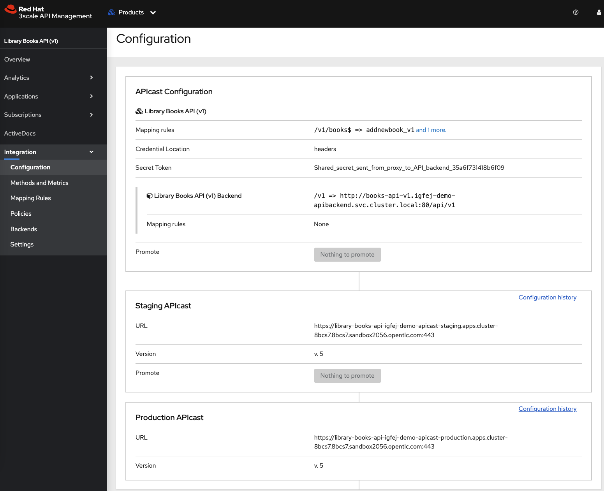

### III. Secure the _Library Books API v2_ using Red Hat 3scale API Management with OpenID Connect

> **NOTE**: Both verions `v1` and `v2` are bundled and exposed as a single API product _Library Books API v2_

1. Using the 3scale Admin Portal UI, create a `Backend` object with the following properties. Menu: _Dashboard -> Create Backend_
    - Name: `Library Books API (v2) Backend`
    - System name: `books-api-v2-backend`
    - Description: `Backend of Library Books API (v2)`
    - Private Base URL: `http://books-api-v2.rhsi-hackfest-apibackend.svc.cluster.local/api/v2`

    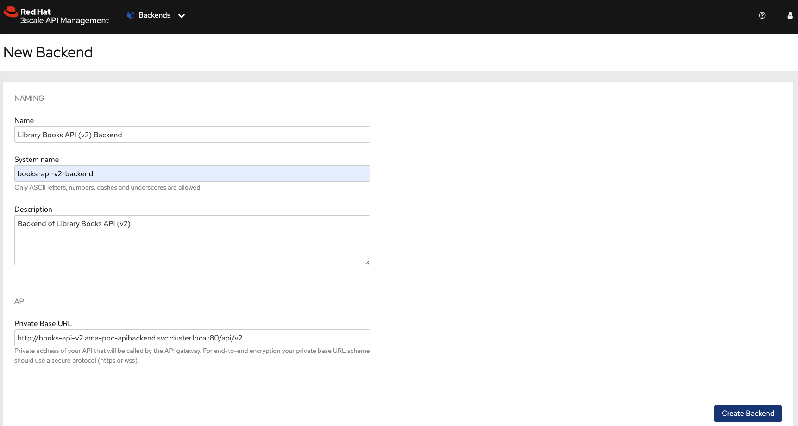

2. Using the 3scale Admin Portail UI, add the `Library Books API (v2) Backend` object to the `Library Books API (v1)` product object with the following properties. Menu: _Products -> Library Books API (v1) -> Integration -> Backends -> Add backend_
    - Backend: `Library Books API (v2) Backend`
    - Path: `/v2`

    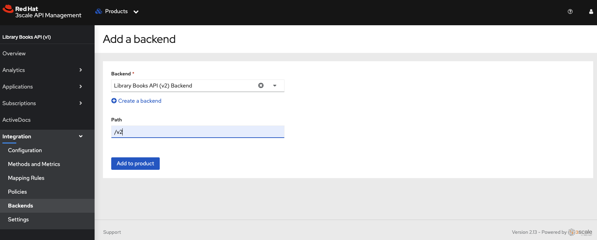

3. Using the [Red Hat 3scale Toolbox CLI](https://access.redhat.com/documentation/en-us/red_hat_THREESCALE_api_management/2.13/html/operating_3scale/the-threescale-toolbox#doc-wrapper), create the API product `v2` methods.

    - `addnewbook-v2` method:
        ```script shell
        3scale method create ${THREESCALE_TOOLBOX_DESTINATION} library-books-api addNewBook-v2 \
        --system-name=addnewbook_v2 \
        --description="Adds a new \`book-v2\` entity in the inventory."
        ```

    - `getbooks-v2` method:
        ```script shell
        3scale method create ${THREESCALE_TOOLBOX_DESTINATION} library-books-api getBooks-v2 \
        --system-name=getbooks_v2 \
        --description="Gets a list of all \`book-v2\` entities."
        ```

    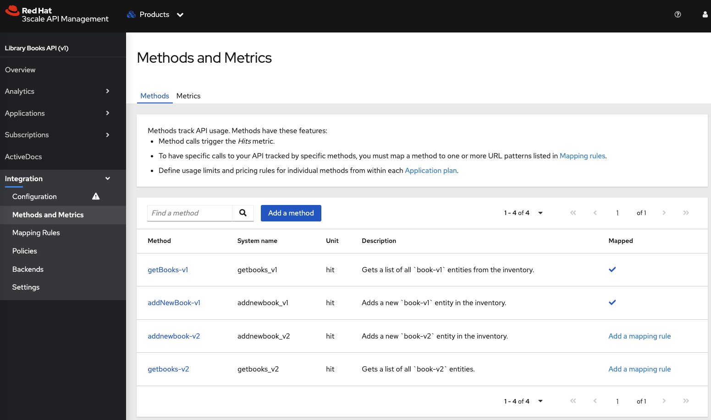

4. Using the 3scale Admin Portail UI, add the following mapping rules. Menu: _Products -> Library Books API (v1) -> Integration -> Mapping Rules -> Create mapping rule_

    - `GET /v2/books$`
        - Verb: `GET`
        - Pattern: `/v2/books$`
        - Method: `getbooks-v2`

        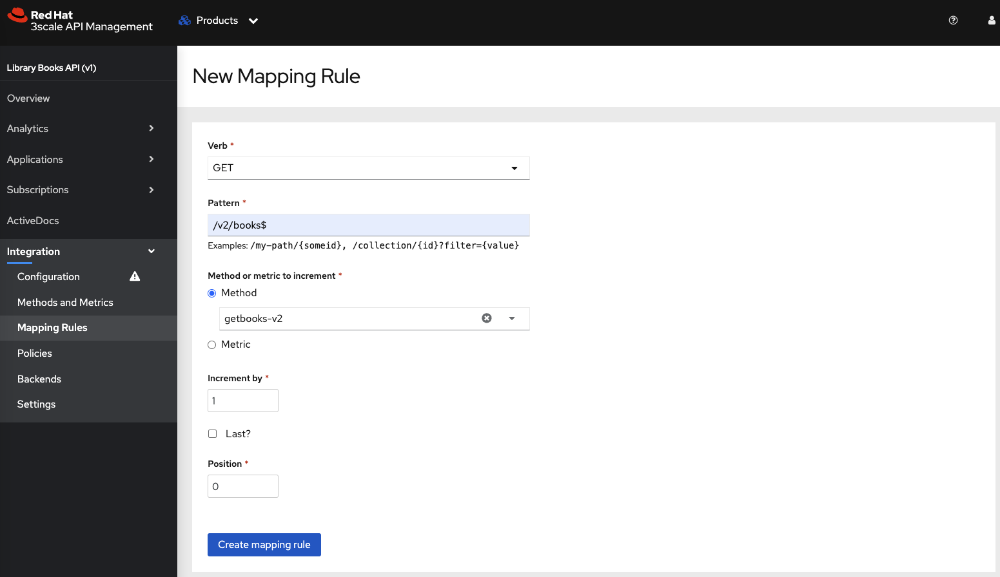

    - `POST /v2/books$`
        - Verb: `POST`
        - Pattern: `/v2/books$`
        - Method: `addnewbook-v2`

        

5. Using the [Red Hat 3scale Toolbox CLI](https://access.redhat.com/documentation/en-us/red_hat_THREESCALE_api_management/2.13/html/operating_3scale/the-threescale-toolbox#doc-wrapper), update the `v1` application plans to disable `v2` operations.

    - Update `Basic v1` plan 
        ```script shell
        3scale application-plan import \
        --file=/tmp/toolbox/library-books-api/threescale/application_plans/basic-v1-plan_afterv2.yaml \
        ${THREESCALE_TOOLBOX_DESTINATION} library-books-api
        ```

    - Update `Premium v1` plan
        ```script shell
        3scale application-plan import \
        --file=/tmp/toolbox/library-books-api/threescale/application_plans/premium-v1-plan_afterv2.yaml \
        ${THREESCALE_TOOLBOX_DESTINATION} library-books-api
        ```

    You can drill down into the details of each application plan to verify the configurations that has been applied. For instance, the details of the `Basic v1` are shown below.

    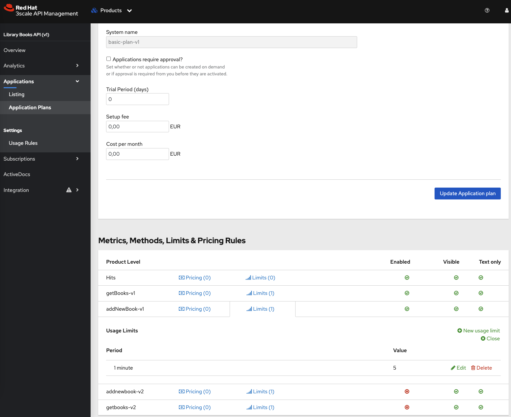

6. Using the [Red Hat 3scale Toolbox CLI](https://access.redhat.com/documentation/en-us/red_hat_THREESCALE_api_management/2.13/html/operating_3scale/the-threescale-toolbox#doc-wrapper), import the `v2` application plans.

    - `Basic v2` plan 
        ```script shell
        3scale application-plan import \
        --file=/tmp/toolbox/library-books-api/threescale/application_plans/basic-v2-plan.yaml \
        ${THREESCALE_TOOLBOX_DESTINATION} library-books-api
        ```

    - `Premium v2` plan
        ```script shell
        3scale application-plan import \
        --file=/tmp/toolbox/library-books-api/threescale/application_plans/premium-v2-plan.yaml \
        ${THREESCALE_TOOLBOX_DESTINATION} library-books-api
        ```

    After importing, you should find the `Basic v2` and `Premium v2` plans on the _Library Books API (v1)_ product page of the 3scale Admin Portal.

    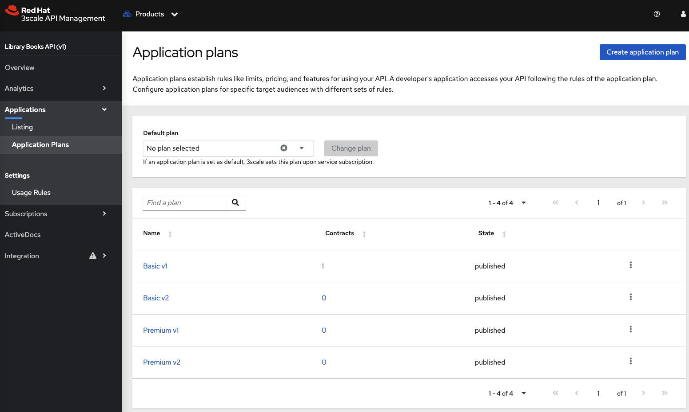

    You can drill down into the details of each application plan to verify the configurations that has been applied. For instance, the details of the `Basic v2` are shown below.

    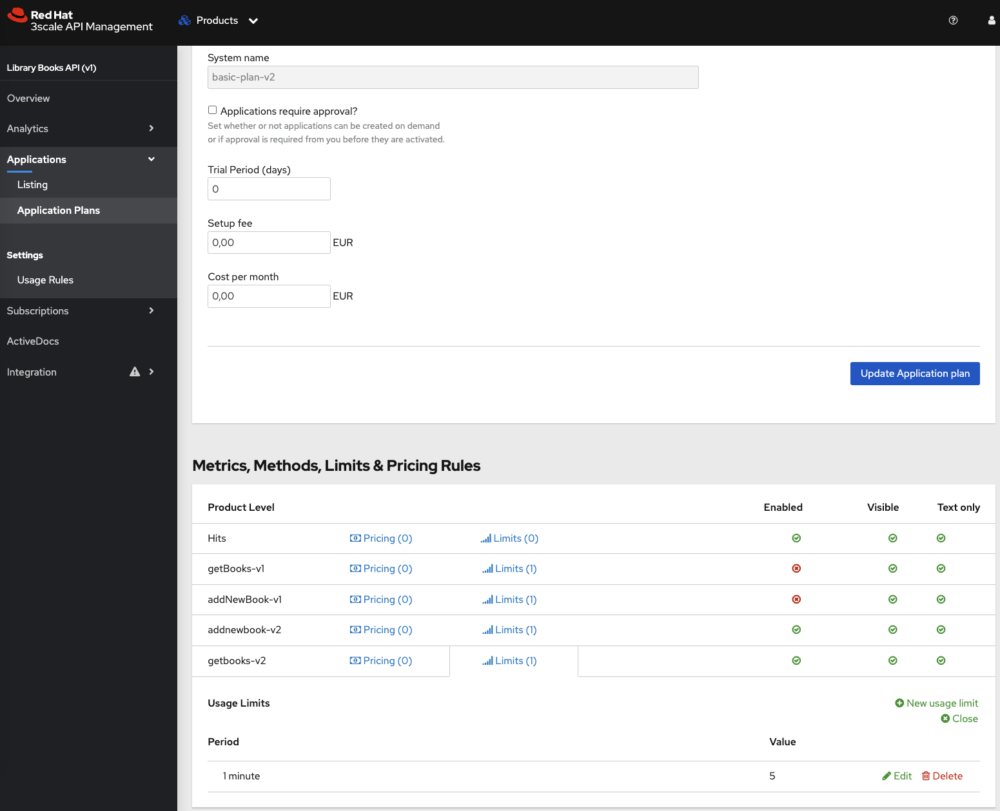

7. Using the [Red Hat 3scale Toolbox CLI](https://access.redhat.com/documentation/en-us/red_hat_THREESCALE_api_management/2.13/html/operating_3scale/the-threescale-toolbox#doc-wrapper), promote the APIcast configuration to the Staging Environment.
    ```script shell
    3scale proxy deploy ${THREESCALE_TOOLBOX_DESTINATION} library-books-api
    ```

    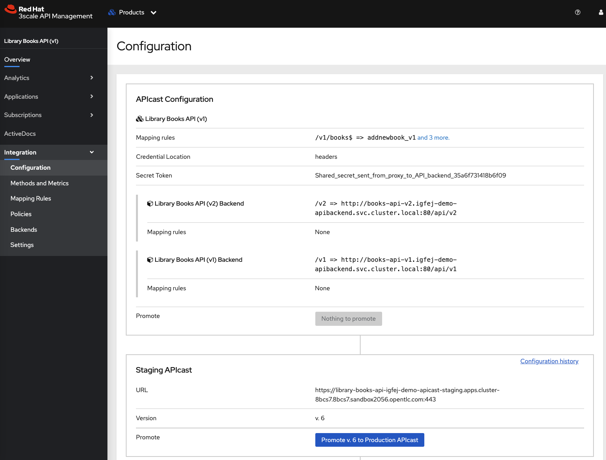

8. Using the [Red Hat 3scale Toolbox CLI](https://access.redhat.com/documentation/en-us/red_hat_THREESCALE_api_management/2.13/html/operating_3scale/the-threescale-toolbox#doc-wrapper), create an application with the default Developer account subscribing to the service `Basic v2` plan in order to test the configuration.
    ```script shell
    3scale application create \
    --description="Developer's Application to the Library Books API (V2 testing purposes)" \
    ${THREESCALE_TOOLBOX_DESTINATION} john library-books-api basic-plan-v2 "Developer's App (v2)"
    ```

    - `Developer's App (v2)` application credentials in 3scale:

        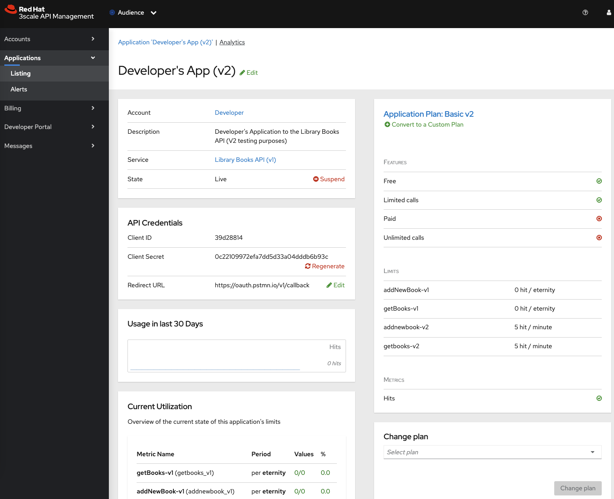

    - `Developer's App (v2)` application credentials are dynamically synchronized in Red Hat Single Sign-On:

        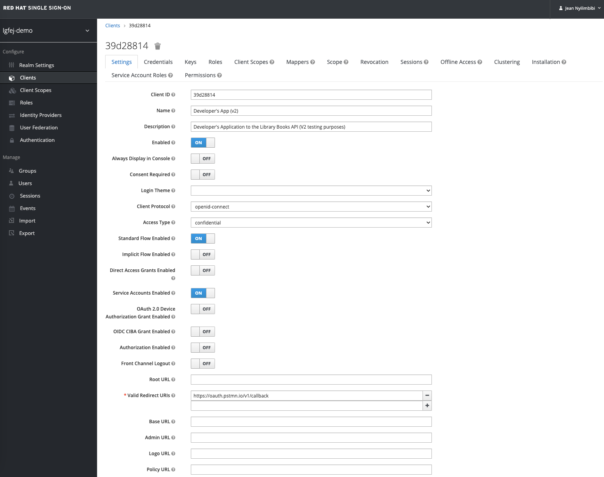

9. Perform some testing of your configuration in the 3scale staging environment.

    1. Get the OpenID Connect access token from your Red Hat Single Sign-On instance. Example using [httpie](https://httpie.io/) and [jq](https://jqlang.github.io/jq/):

        > **NOTE**: replace `client_id` and `client_secret` values with your 3scale application credentials
        ```script shell
        TOKEN=$(http --form POST \
        https://${RH_SSO_HOSTNAME}/auth/realms/rhsi-hackfest/protocol/openid-connect/token \
        grant_type="client_credentials" \
        client_id="<change_me>" \
        client_secret="<change_me>" \
        scope="openid" | jq -r .access_token) \
        && echo $TOKEN
        ```

    2. Test the forbidden `/v1/books` path 

        > **NOTE**: Adjust the 3scale _Staging Public Base URL_ according to your environment.

        - `GET` method:
            ```script shell
            http https://library-books-api-${THREESCALE_TENANT}-apicast-staging.${OCP_DOMAIN}/v1/books "Authorization: Bearer ${TOKEN}"
            ```

            The 3scale API gateway should reject the request.
            ```console
            HTTP/1.1 403 Forbidden
            [...]

            Authentication failed
            ```

        - `POST` method:
            ```script shell
            echo '{                                   
                "authorName": "Test Author",
                "copies": 100,
                "title": "Test Book",
                "year": 2023
            }' | http https://library-books-api-${THREESCALE_TENANT}-apicast-production.${OCP_DOMAIN}/v1/books "Authorization: Bearer ${TOKEN}" "Content-type: application/json"
            ```

            The 3scale API gateway should reject the request.
            ```console
            HTTP/1.1 403 Forbidden
            [...]

            Authentication failed
            ```

    3. Test the authorized `/v2/books` path

        > **NOTE**: Adjust the 3scale _Staging Public Base URL_ according to your environment.

        - `GET` method:
            ```script shell
            http https://library-books-api-${THREESCALE_TENANT}-apicast-staging.${OCP_DOMAIN}/v2/books "Authorization: Bearer ${TOKEN}"
            ```

            The 3scale API gateway should authorize the request.
            ```console
            HTTP/1.1 200 OK
            [...]

            [
                {
                    "author": {
                        "birthDate": "1797-08-30T00:00:00.000Z",
                        "name": "Mary Shelley"
                    },
                    "copies": 10,
                    "title": "Frankenstein",
                    "year": 1818
                },
                {
                    "author": {
                        "birthDate": "1812-02-07T00:00:00.000Z",
                        "name": "Charles Dickens"
                    },
                    "copies": 5,
                    "title": "A Christmas Carol",
                    "year": 1843
                },
                {
                    "author": {
                        "birthDate": "1775-12-16T00:00:00.000Z",
                        "name": "Charles Dickens"
                    },
                    "copies": 3,
                    "title": "Pride and Prejudice",
                    "year": 1813
                }
            ]
            ```

        - `POST` method:
            ```script shell
            echo '{
                "author": {
                    "birthDate": "1980-01-01T00:00:00.000Z",
                    "name": "Test Author"
                },
                "copies": 31,
                "title": "Test Book",
                "year": 2023
            }' | http https://library-books-api-${THREESCALE_TENANT}-apicast-staging.${OCP_DOMAIN}/v2/books "Authorization: Bearer ${TOKEN}" "Content-type: application/json"
            ```

            The 3scale API gateway should authorize the request.
            ```console
            HTTP/1.1 200 OK
            [...]

            [
                {
                    "author": {
                        "birthDate": "1797-08-30T00:00:00.000Z",
                        "name": "Mary Shelley"
                    },
                    "copies": 10,
                    "title": "Frankenstein",
                    "year": 1818
                },
                {
                    "author": {
                        "birthDate": "1812-02-07T00:00:00.000Z",
                        "name": "Charles Dickens"
                    },
                    "copies": 5,
                    "title": "A Christmas Carol",
                    "year": 1843
                },
                {
                    "author": {
                        "birthDate": "1775-12-16T00:00:00.000Z",
                        "name": "Jane Austen"
                    },
                    "copies": 3,
                    "title": "Pride and Prejudice",
                    "year": 1813
                },
                {
                    "author": {
                        "birthDate": "1980-01-01T00:00:00.000Z",
                        "name": "Test Author"
                    },
                    "copies": 31,
                    "title": "Test Book",
                    "year": 2023
                }
            ]
            ```

    4. Test rate limit (5 calls/mn). After 5 consecutive requests, the 3scale API gateway should reject your call.

        > **NOTE**: Adjust the 3scale _Staging Public Base URL_ according to your environment.
        ```script shell
        http https://library-books-api-${THREESCALE_TENANT}-apicast-staging.${OCP_DOMAIN}/v2/books "Authorization: Bearer ${TOKEN}"
        ```

        The 3scale API gateway should reject the request.
        ```console
        HTTP/1.1 429 Too Many Requests
        [...]

        Usage limit exceeded
        ```

10. After performing some tests of your configuration in the 3scale staging environment, you can now promote the latest staging Proxy Configuration to the 3scale production environment.
    ```script shell
    3scale proxy-config promote ${THREESCALE_TOOLBOX_DESTINATION} library-books-api
    ```

11. Using the 3scale Admin Portail UI, edit the name of the product to `Library Books API (v2)`. Menu: _Products -> Library Books API (v1) -> Overview -> edit_

    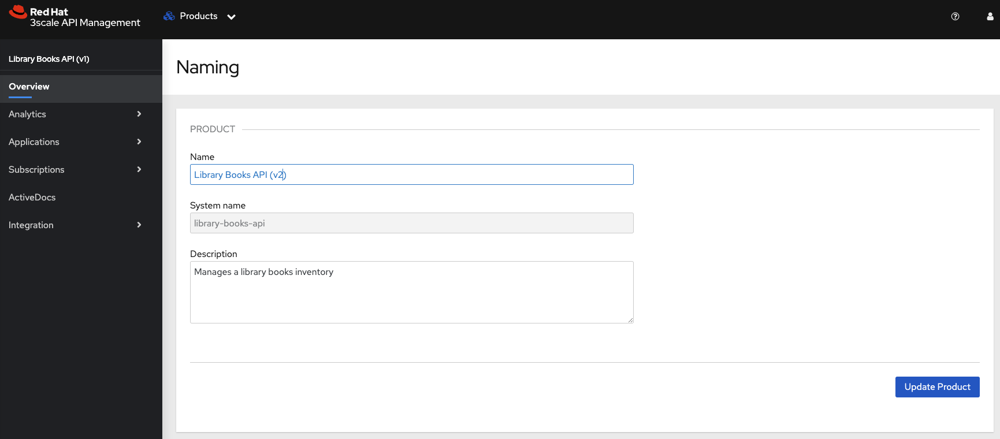

12. Using the 3scale Admin Portail UI, update the ActiveDocs with the [LibraryBooksAPI_v2.json](./library-books-api/threescale/openapi/LibraryBooksAPI_v2.json). Menu: _Products -> Library Books API (v2) -> ActiveDocs -> edit_

    > **NOTE**: Do not forget to change the name to `Library Books API (v2)`

    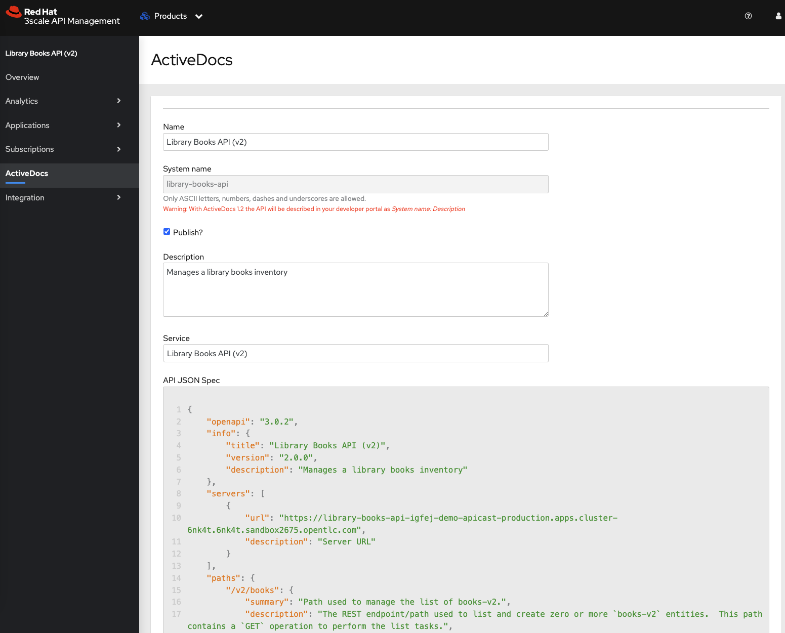

13. Deprecate the `Basic v1` and `Premium v1` application plans so that no new applications can be created from the 3scale Developer Portal. Using the [Red Hat 3scale Toolbox CLI](https://access.redhat.com/documentation/en-us/red_hat_THREESCALE_api_management/2.13/html/operating_3scale/the-threescale-toolbox#doc-wrapper):

    - Deprecate `Basic v1` plan 
        ```script shell
        3scale application-plan apply ${THREESCALE_TOOLBOX_DESTINATION} library-books-api basic-plan-v1 --hide
        ```

    - Deprecate `Premium v1` plan
        ```script shell
        3scale application-plan apply ${THREESCALE_TOOLBOX_DESTINATION} library-books-api premium-plan-v1 --hide
        ```

    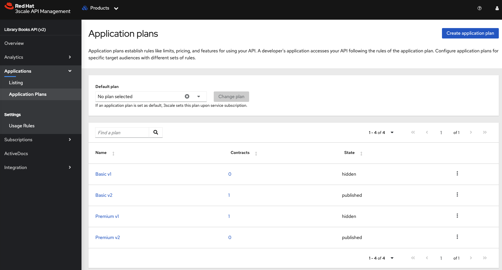
